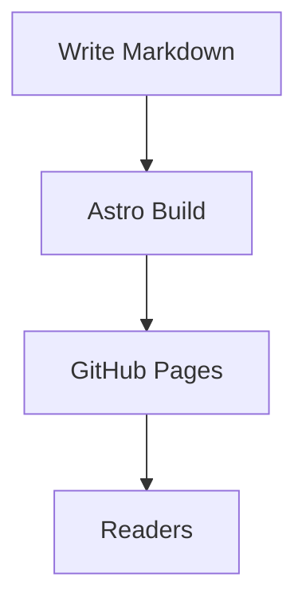
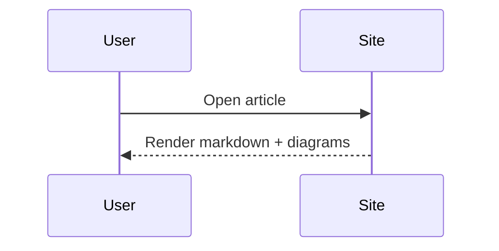
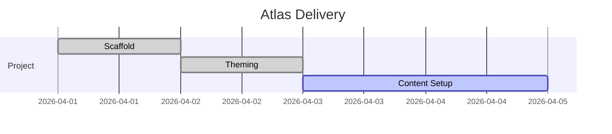
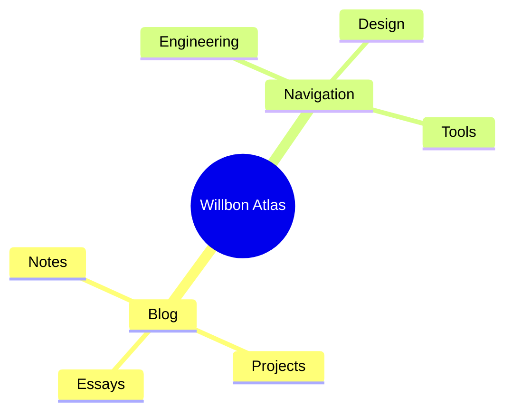

> [!TIP]
> 文章默认支持 `Mermaid` 代码块，你可以直接写流程图、时序图、甘特图和思维导图。

## 表格

| 能力 | 语法 | 备注 |
| --- | --- | --- |
| 数学公式 | LaTeX | 用 KaTeX 渲染 |
| 图表 | Mermaid | 用于流程图、时序图、甘特图 |
| 思维导图 | Mermaid mindmap | 与图表能力共用生态 |

## 代码块

```ts
type NavItem = {
  title: string;
  url: string;
  icon?: string;
};
```

## 流程图



## 时序图



## 甘特图



## 思维导图



## 脚注

脚注能力也要可用。[^1]

[^1]: 这对于技术写作和补充说明很方便。